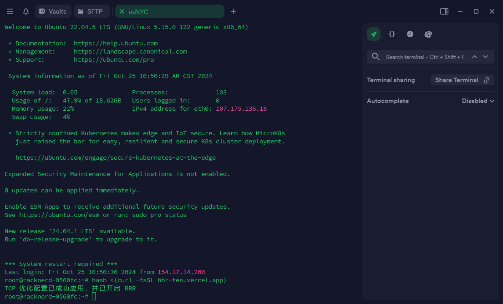

## 终端预览



## 一键脚本
```
bash <(curl -fsSL bbr-pi.vercel.app)
```

这些配置项主要涉及网络和内核参数的调整，其中一些关键点包括：

1. **TCP 参数调整**：
   - net.ipv4.tcp_no_metrics_save: 禁用TCP指标保存，可能用于节省资源。
   - net.ipv4.tcp_ecn: 禁用TCP Explicit Congestion Notification（ECN），可能是因为与某些网络设备或协议不兼容。
   - net.ipv4.tcp_sack net.ipv4.tcp_fack: 启用TCP Selective Acknowledgment（SACK）和Forward Acknowledgment（FACK），用于提高TCP传输效率和可靠性。
   - net.ipv4.tcp_window_scaling net.ipv4.tcp_adv_win_scale: 启用TCP窗口缩放和高级窗口缩放，用于优化TCP拥塞控制和传输性能。
   - net.ipv4.tcp_congestion_control: 使用BBR作为TCP拥塞控制算法，以优化网络吞吐量和延迟。

2. **内核参数调整**：
   - `kernel.kptr_restrict`：限制内核指针的泄漏，以增强系统安全性。
   - `kernel.pid_max`：限制进程ID的最大值，以防止PID溢出攻击。

3. **其他设置**：
   - `net.core.default_qdisc`：使用 fq_codel 作为默认的网络队列调度器，可能用于优化网络流量管理。
   - `fs.protected_*`：保护文件系统中的不同类型文件，防止被恶意修改或者利用。

这些调整可能是为了提高系统的性能、安全性和可靠性，但具体效果还需根据系统的具体情况和使用场景来评估。


## 项目地址：https://github.com/google/bbr
